# 📊 Correlation System - Visual Diagrams
# ไดอะแกรมการหา Correlation ในระบบ Arbi Trading

## 🔄 ภาพรวม: Multi-Layer Correlation System

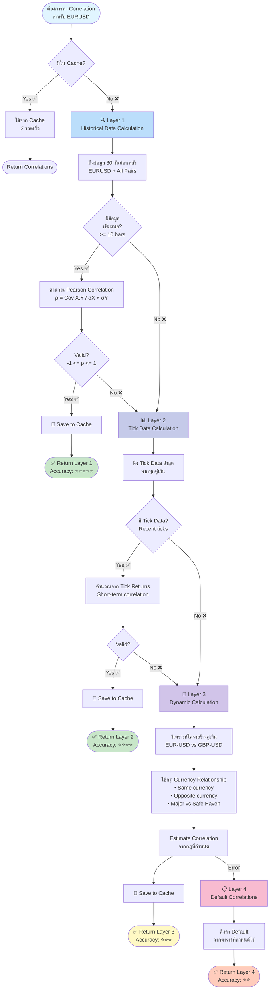

---

## 📈 Layer 1: Historical Data Calculation (วิธีที่แม่นยำที่สุด)

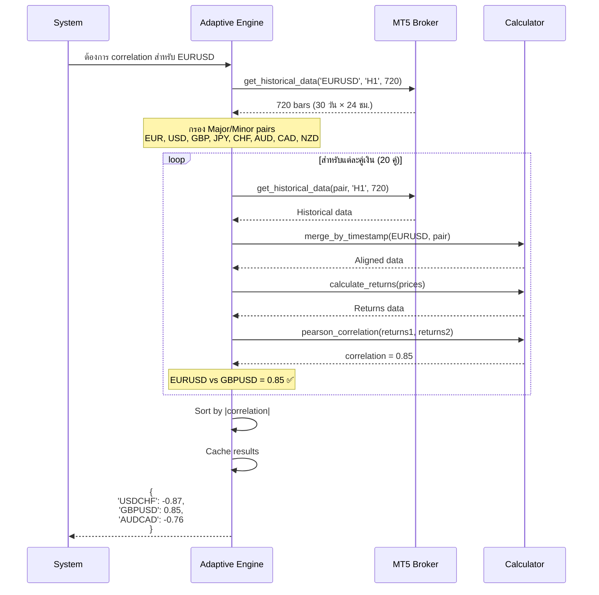

---

## 🔬 การคำนวณ Correlation แบบละเอียด

```mermaid
graph LR
    subgraph "1. ดึงข้อมูลราคา"
        A1[EURUSD Prices<br/>1.1000, 1.1010, 1.1005, ...]
        A2[GBPUSD Prices<br/>1.2500, 1.2510, 1.2505, ...]
    end
    
    subgraph "2. Merge ตาม Timestamp"
        B1[Aligned Data<br/>timestamp | EUR | GBP<br/>10:00 | 1.1000 | 1.2500<br/>11:00 | 1.1010 | 1.2510<br/>12:00 | 1.1005 | 1.2505]
    end
    
    subgraph "3. คำนวณ Returns"
        C1[EUR Returns<br/>+0.09%, -0.05%, ...]
        C2[GBP Returns<br/>+0.08%, -0.04%, ...]
    end
    
    subgraph "4. คำนวณ Correlation"
        D1[Pearson ρ<br/>ρ = Cov/σ1·σ2]
        D2[Result<br/>ρ = 0.85]
    end
    
    A1 --> B1
    A2 --> B1
    B1 --> C1
    B1 --> C2
    C1 --> D1
    C2 --> D1
    D1 --> D2
    
    style D2 fill:#c8e6c9
```

### สูตรการคำนวณ:

```
Returns (ผลตอบแทน):
r[t] = (P[t] - P[t-1]) / P[t-1]

ตัวอย่าง:
Price[0] = 1.1000
Price[1] = 1.1010
Returns[1] = (1.1010 - 1.1000) / 1.1000 = 0.0009 = 0.09%

Pearson Correlation:
         Σ[(X - X̄)(Y - Ȳ)]
ρ = ─────────────────────────
    √[Σ(X - X̄)²] × √[Σ(Y - Ȳ)²]

หรือ:
    Cov(X,Y)
ρ = ─────────
     σ_X × σ_Y
```

---

## 🧮 Layer 3: Dynamic Correlation (การวิเคราะห์โครงสร้าง)

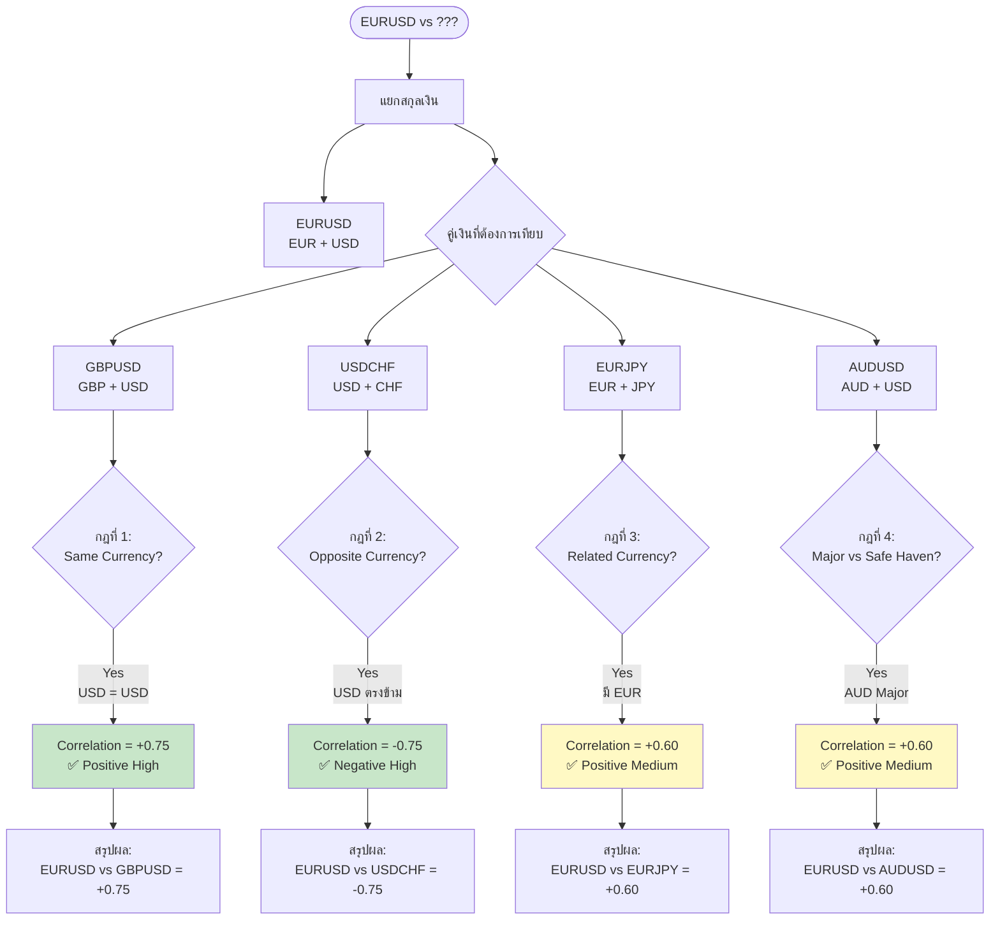

### กฎการวิเคราะห์:

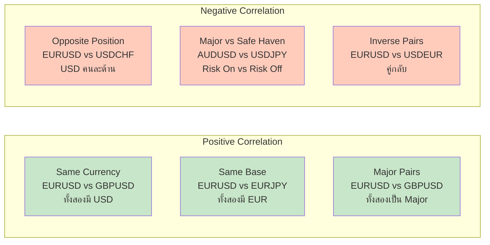

---

## 🎯 การใช้ Correlation ใน Recovery Process

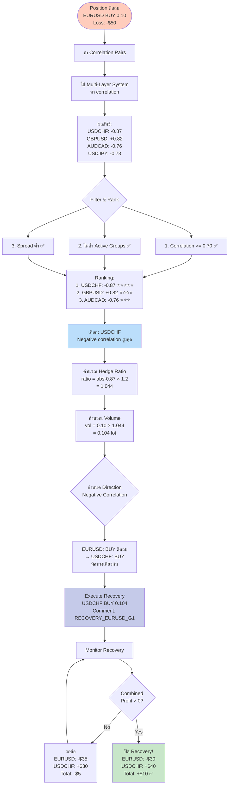

---

## 📊 ตัวอย่างการคำนวณจริง

### ตัวอย่างที่ 1: Positive Correlation

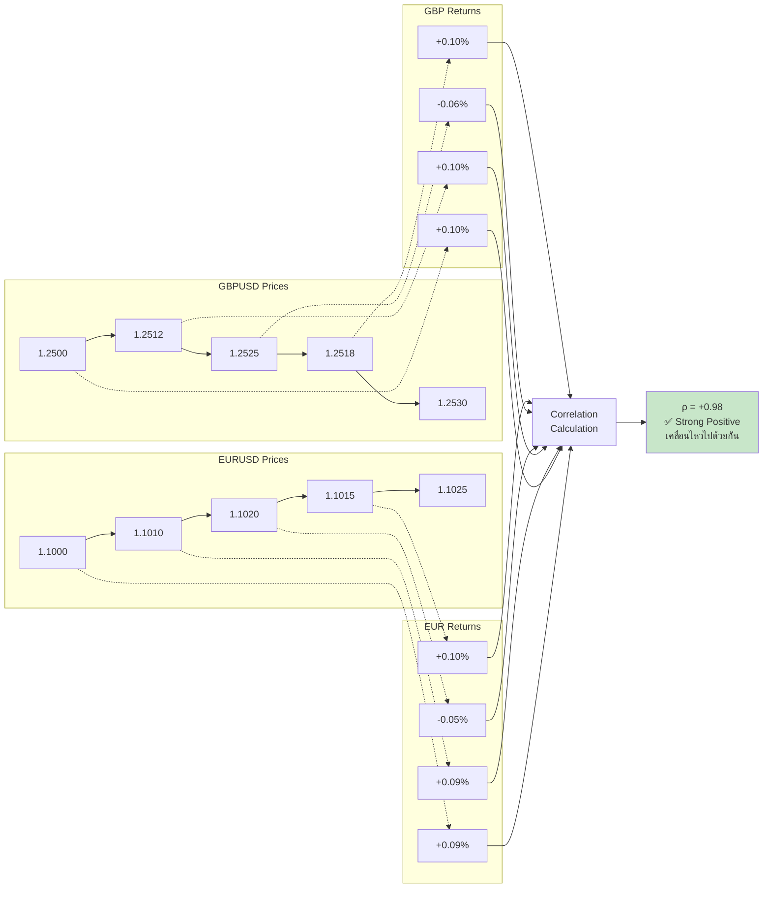

### ตัวอย่างที่ 2: Negative Correlation

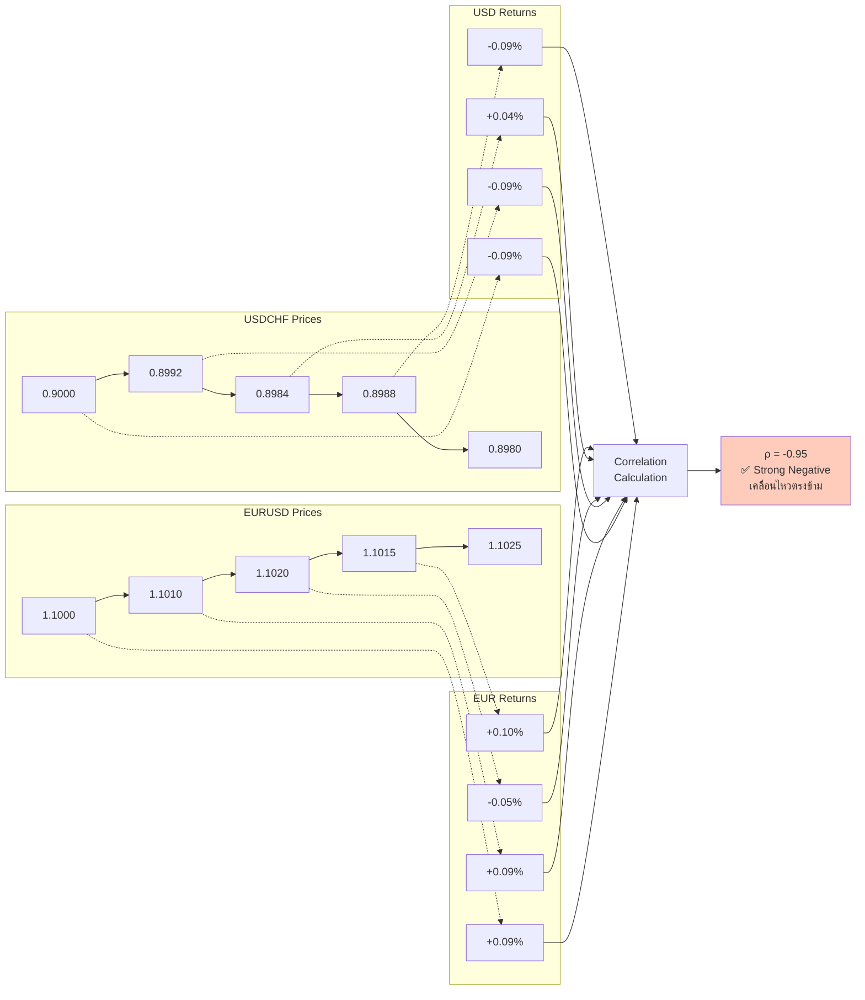

---

## 🔄 Complete Recovery Flow with Correlation

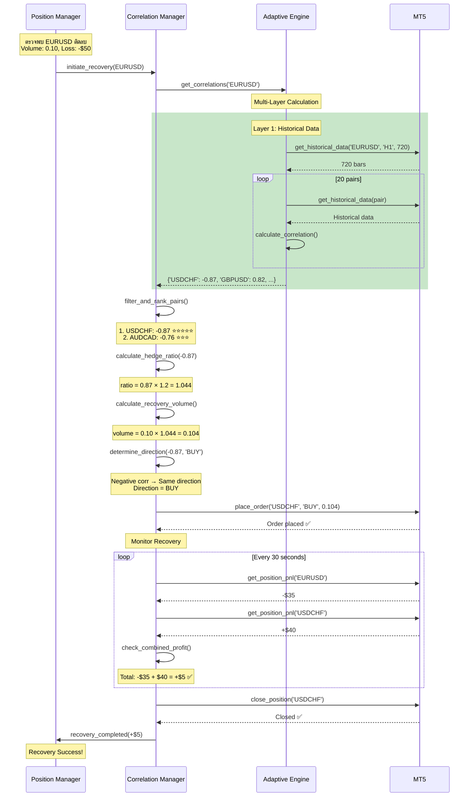

---

## 📈 Correlation Matrix Visualization

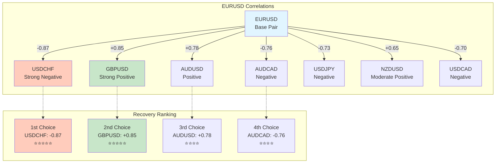

---

## 🎯 Decision Matrix: เลือก Recovery Pair

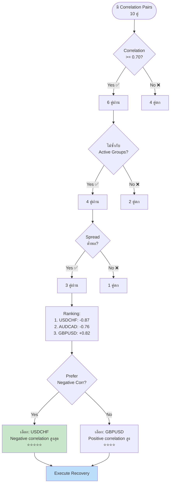

---

## 📊 Performance Comparison

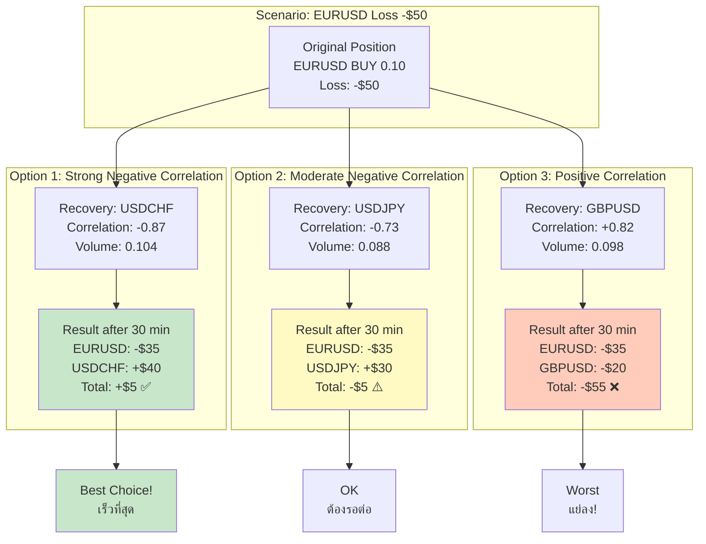

---

## 🔍 Correlation Quality Indicators

```mermaid
graph LR
    subgraph "Excellent"
        E1[|ρ| >= 0.85<br/>⭐️⭐️⭐️⭐️⭐️]
        E2[EURUSD vs USDCHF<br/>ρ = -0.87]
        E3[ใช้ได้ทันที!]
    end
    
    subgraph "Good"
        G1[|ρ| 0.75-0.84<br/>⭐️⭐️⭐️⭐️]
        G2[EURUSD vs GBPUSD<br/>ρ = +0.82]
        G3[ใช้ได้ดี]
    end
    
    subgraph "Fair"
        F1[|ρ| 0.70-0.74<br/>⭐️⭐️⭐️]
        F2[EURUSD vs USDJPY<br/>ρ = -0.73]
        F3[ใช้ได้ แต่ระมัดระวัง]
    end
    
    subgraph "Poor"
        P1[|ρ| < 0.70<br/>⭐️⭐️]
        P2[EURUSD vs AUDNZD<br/>ρ = +0.65]
        P3[ไม่แนะนำ]
    end
    
    E1 --> E2 --> E3
    G1 --> G2 --> G3
    F1 --> F2 --> F3
    P1 --> P2 --> P3
    
    style E3 fill:#c8e6c9
    style G3 fill:#c8e6c9
    style F3 fill:#fff9c4
    style P3 fill:#ffccbc
```

---

## 📋 Summary: ทำไมต้องใช้หลาย Layer?

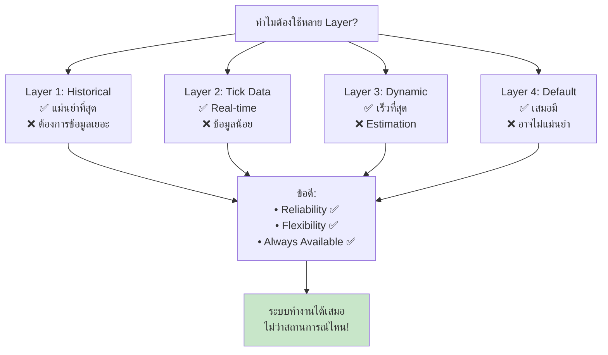

---

## 🎓 Key Takeaways

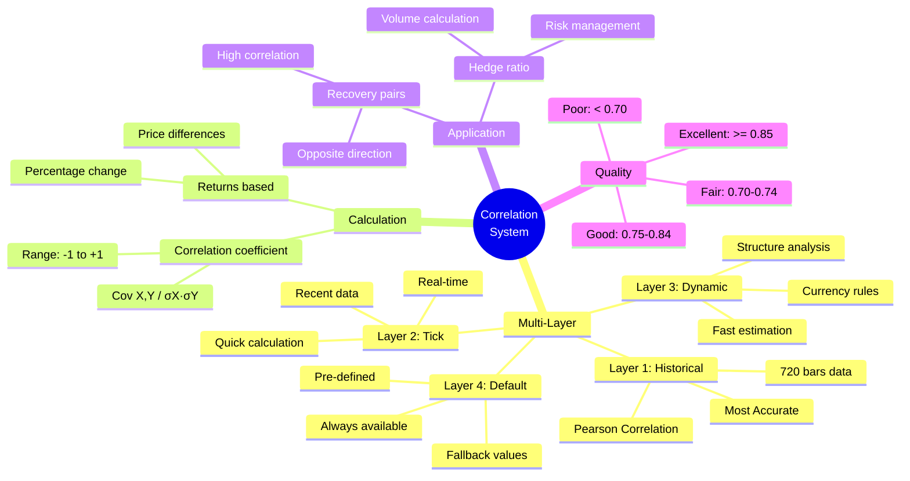

---

## 📖 อ้างอิง

**เอกสารเพิ่มเติม:**
- [CORRELATION_GUIDE.md](./CORRELATION_GUIDE.md) - คู่มือการหา Correlation แบบละเอียด
- [utils/calculations.py](./utils/calculations.py) - โค้ดคำนวณ Correlation
- [trading/adaptive_engine.py](./trading/adaptive_engine.py) - Adaptive Engine Implementation
- [trading/correlation_manager.py](./trading/correlation_manager.py) - Correlation Manager Implementation

---

**สร้างโดย:** Arbi Trading System  
**วันที่:** 8 ตุลาคม 2025  
**เวอร์ชัน:** 2.0 (Adaptive Engine)
