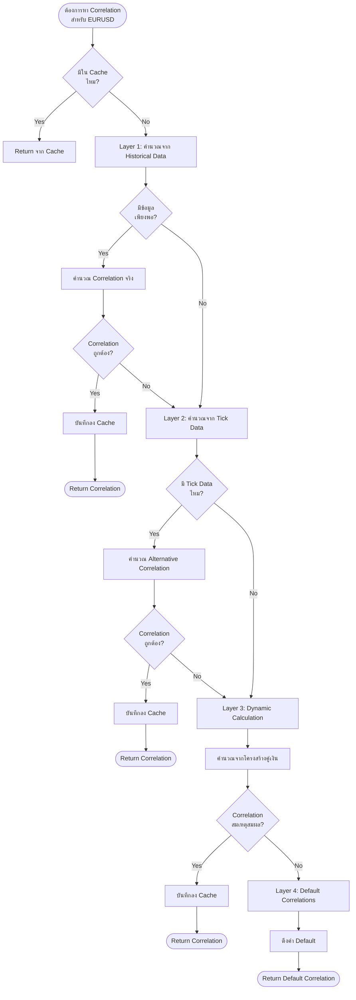

# คู่มือการหา Correlation ในระบบ Arbi Trading
# Correlation Calculation Guide

## 📊 ภาพรวม: ระบบหา Correlation แบบ Multi-Layer

ระบบของคุณมีการหา Correlation แบบ **หลายชั้น (Multi-Layer)** เพื่อความแม่นยำและความยืดหยุ่น:

```
Layer 1: Real-time Calculation จาก Historical Data ✅ (ดีที่สุด)
   ↓ ถ้าไม่ได้
Layer 2: Alternative Calculation จาก Tick Data 📊
   ↓ ถ้าไม่ได้
Layer 3: Dynamic Correlation จากโครงสร้างคู่เงิน 🧮
   ↓ ถ้าไม่ได้
Layer 4: Default Correlations (Fallback) 📋
```

---

## 🎯 Layer 1: Real-time Calculation (จาก Historical Data)

### วิธีการทำงาน

```python
# ไฟล์: trading/adaptive_engine.py
# ฟังก์ชัน: _calculate_on_demand_correlations()
```

### ขั้นตอนการคำนวณ:

#### 1. ดึงข้อมูลราคาย้อนหลัง (Historical Data)
```
- ดึงข้อมูลย้อนหลัง 30 วัน (30 * 24 = 720 ชั่วโมง)
- ใช้ Timeframe: H1 (1 ชั่วโมง)
- จาก MT5 ผ่าน broker.get_historical_data()

ตัวอย่าง:
EURUSD: [1.1000, 1.1010, 1.1005, 1.0995, ...]  (720 จุด)
GBPUSD: [1.2500, 1.2510, 1.2505, 1.2495, ...]  (720 จุด)
```

#### 2. จับคู่ข้อมูลตาม Timestamp
```python
# Align data โดยใช้ pandas merge
merged = pd.merge(
    base_data[['close']],      # EURUSD
    pair_data[['close']],       # GBPUSD
    left_index=True,            # ใช้ timestamp
    right_index=True,
    suffixes=('_base', '_pair')
)

# ผลลัพธ์:
# timestamp          | close_base | close_pair
# 2025-10-01 00:00  | 1.1000     | 1.2500
# 2025-10-01 01:00  | 1.1010     | 1.2510
# ...
```

#### 3. คำนวณ Returns (ผลตอบแทน)
```python
# คำนวณ % การเปลี่ยนแปลงระหว่างช่วงเวลา
returns_base = merged['close_base'].pct_change().dropna()
returns_pair = merged['close_pair'].pct_change().dropna()

# ตัวอย่าง:
# EURUSD returns: [0.0009, -0.0005, -0.0009, ...]  (% change)
# GBPUSD returns: [0.0008, -0.0004, -0.0008, ...]  (% change)
```

#### 4. คำนวณ Correlation
```python
# ใช้ Pearson Correlation Coefficient
correlation = returns_base.corr(returns_pair)

# สูตร:
# ρ = Cov(X,Y) / (σ_X × σ_Y)
# 
# โดยที่:
# - Cov(X,Y) = Covariance ระหว่าง X และ Y
# - σ_X = Standard Deviation ของ X
# - σ_Y = Standard Deviation ของ Y
```

### ผลลัพธ์ตัวอย่าง:
```
EURUSD vs GBPUSD = 0.85  (Positive correlation สูง)
EURUSD vs USDCHF = -0.82 (Negative correlation สูง)
EURUSD vs USDJPY = -0.70 (Negative correlation ปานกลาง)
```

### โค้ดตัวอย่าง:
```python
def calculate_correlation(self, symbol1, symbol2, lookback_days=30):
    """
    คำนวณ correlation จริงจากข้อมูล MT5
    """
    # 1. ดึงข้อมูลราคา
    data1 = self.broker.get_historical_data(symbol1, 'H1', lookback_days * 24)
    data2 = self.broker.get_historical_data(symbol2, 'H1', lookback_days * 24)
    
    # 2. Merge data
    merged = pd.merge(data1[['close']], data2[['close']], 
                     left_index=True, right_index=True)
    
    # 3. คำนวณ returns
    returns1 = merged['close_x'].pct_change().dropna()
    returns2 = merged['close_y'].pct_change().dropna()
    
    # 4. คำนวณ correlation
    correlation = returns1.corr(returns2)
    
    return correlation  # ค่า -1.0 ถึง +1.0
```

### การแปลผล:
```
Correlation Value    | ความหมาย
--------------------|--------------------
+0.9 ถึง +1.0       | เคลื่อนไหวไปทางเดียวกันมากๆ
+0.7 ถึง +0.9       | เคลื่อนไหวไปทางเดียวกัน
+0.3 ถึง +0.7       | เคลื่อนไหวไปทางเดียวกันบ้าง
-0.3 ถึง +0.3       | ไม่มีความสัมพันธ์ชัดเจน
-0.7 ถึง -0.3       | เคลื่อนไหวตรงข้ามบ้าง
-0.9 ถึง -0.7       | เคลื่อนไหวตรงข้าม
-1.0 ถึง -0.9       | เคลื่อนไหวตรงข้ามมากๆ
```

---

## 📊 Layer 2: Alternative Calculation (จาก Tick Data)

### เมื่อไหร่ใช้?
- เมื่อไม่มีข้อมูล Historical Data เพียงพอ
- เมื่อ Layer 1 ล้มเหลว

### วิธีการทำงาน:

```python
# ไฟล์: trading/adaptive_engine.py
# ฟังก์ชัน: _calculate_correlations_alternative()
```

### ขั้นตอน:

#### 1. ดึง Tick Data แทน Historical Data
```python
# ดึงข้อมูล Tick ล่าสุดจากทุกคู่เงิน
tick_data = self.broker.get_tick_data()

# ตัวอย่าง tick_data:
{
    'EURUSD': {'bid': 1.1000, 'ask': 1.1002, 'timestamp': ...},
    'GBPUSD': {'bid': 1.2500, 'ask': 1.2502, 'timestamp': ...},
    ...
}
```

#### 2. รวบรวมข้อมูล Tick เป็นช่วงเวลา
```
ตัวอย่าง: เก็บ Tick ทุก 1 นาที เป็นเวลา 1 ชั่วโมง
= 60 จุดข้อมูล

EURUSD: [1.1000, 1.1001, 1.0999, ...]
GBPUSD: [1.2500, 1.2501, 1.2499, ...]
```

#### 3. คำนวณ Correlation เหมือน Layer 1
```python
# คำนวณ returns และ correlation
returns1 = np.diff(prices1) / prices1[:-1]
returns2 = np.diff(prices2) / prices2[:-1]

correlation = np.corrcoef(returns1, returns2)[0, 1]
```

### ข้อดี:
- ✅ ใช้ข้อมูลล่าสุด (Real-time)
- ✅ ทำงานได้แม้ไม่มี Historical Data

### ข้อเสีย:
- ⚠️ ข้อมูลน้อยกว่า (มีแค่ tick ล่าสุด)
- ⚠️ อาจไม่แม่นยำเท่า Historical Data

---

## 🧮 Layer 3: Dynamic Correlation (จากโครงสร้างคู่เงิน)

### เมื่อไหร่ใช้?
- เมื่อไม่มีข้อมูล Historical และ Tick Data
- ใช้เป็น Estimation

### วิธีการทำงาน:

```python
# ไฟล์: trading/correlation_manager.py
# ฟังก์ชัน: _calculate_dynamic_correlation()
```

### หลักการ: วิเคราะห์สกุลเงินในคู่เงิน

```
คู่เงิน = สกุลเงิน 1 + สกุลเงิน 2

EURUSD = EUR + USD
GBPUSD = GBP + USD
EURGBP = EUR + GBP
```

### กฎการคำนวณ:

#### กฎที่ 1: สกุลเงินเดียวกัน → Positive Correlation สูง
```
EURUSD (EUR/USD) vs GBPUSD (GBP/USD)
→ ทั้งสองมี USD → Correlation = 0.75

เหตุผล: ถ้า USD แข็ง → EURUSD ลง และ GBPUSD ลง (เหมือนกัน)
```

#### กฎที่ 2: สกุลเงินตรงข้าม → Negative Correlation สูง
```
EURUSD (EUR/USD) vs USDCHF (USD/CHF)
→ USD อยู่คนละด้าน → Correlation = -0.75

เหตุผล: ถ้า USD แข็ง → EURUSD ลง แต่ USDCHF ขึ้น (ตรงข้าม)
```

#### กฎที่ 3: สกุลเงินเกี่ยวข้อง → Correlation ปานกลาง
```
EURUSD (EUR/USD) vs EURJPY (EUR/JPY)
→ ทั้งสองมี EUR → Correlation = 0.60

GBPUSD (GBP/USD) vs GBPJPY (GBP/JPY)
→ ทั้งสองมี GBP → Correlation = 0.60
```

#### กฎที่ 4: Major vs Safe Haven → Negative Correlation
```
Majors: EUR, GBP, AUD, NZD, CAD
Safe Havens: JPY, CHF, USD

AUDUSD (Major) vs USDJPY (Safe Haven)
→ Correlation = -0.70

เหตุผล: เมื่อตลาดเสี่ยง → Majors ลง, Safe Havens ขึ้น
```

### โค้ดตัวอย่าง:

```python
def _calculate_dynamic_correlation(self, base_symbol, target_symbol):
    """
    คำนวณ correlation จากโครงสร้างคู่เงิน
    """
    # แยกสกุลเงิน
    base_curr1 = base_symbol[:3]    # EUR
    base_curr2 = base_symbol[3:6]   # USD
    
    target_curr1 = target_symbol[:3]  # GBP
    target_curr2 = target_symbol[3:6] # USD
    
    # กฎที่ 1: สกุลเงินเดียวกัน
    if base_curr1 == target_curr1 or base_curr2 == target_curr2:
        return 0.75  # Positive correlation สูง
    
    # กฎที่ 2: สกุลเงินตรงข้าม
    if base_curr1 == target_curr2 or base_curr2 == target_curr1:
        return -0.75  # Negative correlation สูง
    
    # กฎที่ 3: USD pairs
    if 'USD' in [base_curr1, base_curr2] and 'USD' in [target_curr1, target_curr2]:
        return 0.60  # Correlation ปานกลาง
    
    # กฎที่ 4: Major vs Safe Haven
    majors = ['EUR', 'GBP', 'AUD', 'NZD', 'CAD']
    safe_havens = ['JPY', 'CHF', 'USD']
    
    if base_curr1 in majors and target_curr1 in safe_havens:
        return -0.70  # Negative correlation
    
    # Default
    return 0.50
```

### ตัวอย่างการคำนวณ:

```
คำถาม: EURUSD vs GBPUSD มี correlation เท่าไหร่?

คำตอบ:
EURUSD = EUR + USD
GBPUSD = GBP + USD
→ ทั้งสองมี USD (สกุลเงินเดียวกัน)
→ Correlation = 0.75 ✅
```

```
คำถาม: EURUSD vs USDCHF มี correlation เท่าไหร่?

คำตอบ:
EURUSD = EUR + USD  (USD อยู่ด้านขวา)
USDCHF = USD + CHF  (USD อยู่ด้านซ้าย)
→ USD อยู่คนละด้าน (สกุลเงินตรงข้าม)
→ Correlation = -0.75 ✅
```

```
คำถาม: AUDUSD vs USDJPY มี correlation เท่าไหร่?

คำตอบ:
AUDUSD = AUD (Major) + USD
USDJPY = USD + JPY (Safe Haven)
→ Major vs Safe Haven
→ Correlation = -0.70 ✅
```

---

## 📋 Layer 4: Default Correlations (Fallback)

### เมื่อไหร่ใช้?
- เมื่อทุกวิธีล้มเหลว
- ใช้เป็นค่า Backup

### วิธีการทำงาน:

```python
# ไฟล์: trading/adaptive_engine.py
# ฟังก์ชัน: _get_default_correlations()
```

### ข้อมูล Default Correlations:

```python
default_correlations = {
    'EURUSD': {
        'USDCHF': -0.85,  # Negative correlation สูงสุด
        'AUDCAD': -0.75,
        'USDCAD': -0.72,
        'GBPCHF': -0.80,
        'GBPAUD': -0.68,
        'NZDUSD': -0.65,
    },
    'GBPUSD': {
        'USDCHF': -0.80,
        'USDCAD': -0.70,
        'AUDCAD': -0.68,
        'EURAUD': -0.65,
        'NZDCAD': -0.62
    },
    'USDJPY': {
        'EURUSD': -0.75,
        'GBPUSD': -0.70,
        'AUDUSD': -0.65,
        'NZDUSD': -0.60
    },
    # ... (และคู่เงินอื่นๆ)
}
```

### วิธีใช้:

```python
# ถ้าต้องการหา correlation pairs สำหรับ EURUSD
correlations = default_correlations['EURUSD']

# ผลลัพธ์:
# {
#   'USDCHF': -0.85,
#   'AUDCAD': -0.75,
#   ...
# }

# จัดเรียงตาม correlation จากสูงไปต่ำ
sorted_pairs = sorted(correlations.items(), 
                     key=lambda x: abs(x[1]), 
                     reverse=True)

# ผลลัพธ์:
# [('USDCHF', -0.85),  ← เลือกคู่นี้
#  ('GBPCHF', -0.80),
#  ('AUDCAD', -0.75),
#  ...]
```

---

## 🔄 Flow การหา Correlation ในระบบจริง



---

## 📐 การใช้ Correlation ในการ Recovery

### ขั้นตอนการใช้งานจริง:

#### 1. ตรวจจับตำแหน่งติดลบ
```
EURUSD: Volume 0.10 lot, Loss = -$50
```

#### 2. หา Correlation Pairs
```python
# หา correlation กับคู่เงินอื่นๆ
correlations = adaptive_engine.get_correlations('EURUSD')

# ผลลัพธ์:
{
    'USDCHF': -0.85,   ← เลือกนี้ (Negative correlation สูงสุด)
    'GBPCHF': -0.80,
    'AUDCAD': -0.75,
    'GBPUSD': +0.75,   ← Positive correlation (ไม่เลือก)
    'USDJPY': -0.70,
    ...
}
```

#### 3. เลือก Top Candidates
```
เกณฑ์การเลือก:
✓ Correlation >= 0.70 (สูงพอ)
✓ ไม่ซ้ำกับ Active Groups
✓ Spread ไม่สูงเกินไป

Top 3:
1. USDCHF: -0.85 ⭐️⭐️⭐️⭐️⭐️
2. GBPCHF: -0.80 ⭐️⭐️⭐️⭐️
3. AUDCAD: -0.75 ⭐️⭐️⭐️
```

#### 4. คำนวณ Hedge Ratio
```python
# Correlation = -0.85 (Negative)
hedge_ratio = abs(correlation) * 1.2
hedge_ratio = 0.85 * 1.2 = 1.02

# คำนวณ Recovery Volume
recovery_volume = original_volume * hedge_ratio
recovery_volume = 0.10 * 1.02 = 0.102 lot
```

#### 5. กำหนด Direction
```
Correlation = -0.85 (Negative)
→ เคลื่อนไหวตรงข้าม

EURUSD: BUY (ติดลบ)
→ USDCHF: BUY (ทิศทางเดียวกัน)

เหตุผล:
- EURUSD ขึ้น (กลับตัว) → USDCHF ลง
- USDCHF BUY ได้กำไร → ชดเชย EURUSD ที่ติดลบ
```

#### 6. Execute Recovery Order
```python
order = {
    'symbol': 'USDCHF',
    'type': 'BUY',
    'volume': 0.102,
    'comment': 'RECOVERY_EURUSD_G1',
    'magic': 234001
}
```

---

## 🎯 ตัวอย่างการทำงานจริง

### สถานการณ์: EURUSD ติดลบ

```
เวลา 10:00
├─ EURUSD BUY 0.10 lot @ 1.1000
├─ PnL: -$50
└─ สถานะ: ติดลบ
```

### ขั้นตอนที่ 1: หา Correlation
```python
correlations = get_correlations('EURUSD')

# ผลลัพธ์จาก Layer 1 (Historical Data):
{
    'USDCHF': -0.87,  # คำนวณจริงจาก 30 วันย้อนหลัง
    'GBPUSD': +0.82,
    'USDJPY': -0.73,
    'AUDCAD': -0.76,
    ...
}
```

### ขั้นตอนที่ 2: เลือก Recovery Pair
```
Ranking:
1. USDCHF: -0.87 (Negative, สูงสุด) ✅
2. GBPUSD: +0.82 (Positive, ไม่เหมาะ) ❌
3. AUDCAD: -0.76 (Negative, สูง) ✅
4. USDJPY: -0.73 (Negative, สูง) ✅

เลือก: USDCHF (-0.87)
```

### ขั้นตอนที่ 3: คำนวณ Volume และ Direction
```python
# Hedge Ratio
hedge_ratio = abs(-0.87) * 1.2 = 1.044

# Recovery Volume
recovery_volume = 0.10 * 1.044 = 0.104 lot

# Direction (Negative Correlation)
original_type = 'BUY'
recovery_type = 'BUY'  # เดียวกัน (เพราะ negative)
```

### ขั้นตอนที่ 4: Execute Recovery
```
เวลา 10:05
├─ EURUSD BUY 0.10 @ 1.1000 (PnL: -$50)
└─ USDCHF BUY 0.104 @ 0.9000 (Recovery)
```

### ขั้นตอนที่ 5: Monitor Recovery
```
เวลา 10:15
├─ EURUSD: -$45 (ดีขึ้นเล็กน้อย)
├─ USDCHF: +$20 (กำไร!)
└─ รวม: -$25 (ดีขึ้นจาก -$50)

เวลา 10:30
├─ EURUSD: -$35
├─ USDCHF: +$40
└─ รวม: +$5 ✅ (กลับมาเป็นบวก!)
```

### ขั้นตอนที่ 6: Close Recovery
```
เวลา 10:35
├─ ปิด USDCHF (กำไร $40)
├─ EURUSD: -$30 (ยังติดลบแต่ดีขึ้น)
└─ รวม: +$10 (สำเร็จ!)
```

---

## 📊 สรุปการใช้ Correlation แต่ละแบบ

| Layer | วิธีการ | ข้อดี | ข้อเสีย | ความแม่นยำ |
|-------|---------|-------|---------|------------|
| 1. Historical | คำนวณจริงจาก MT5 | แม่นยำที่สุด | ต้องมีข้อมูลเยอะ | ⭐️⭐️⭐️⭐️⭐️ |
| 2. Tick Data | ใช้ Tick ล่าสุด | Real-time | ข้อมูลน้อย | ⭐️⭐️⭐️⭐️ |
| 3. Dynamic | วิเคราะห์โครงสร้าง | เร็วที่สุด | Estimation | ⭐️⭐️⭐️ |
| 4. Default | ใช้ค่าตายตัว | เสถียร | อาจไม่แม่นยำ | ⭐️⭐️ |

---

## 💡 Tips และ Best Practices

### 1. เลือก Correlation ที่สูงพอ
```
✅ Correlation >= 0.70  (ใช้ได้)
⚠️ Correlation 0.50-0.70 (ระมัดระวัง)
❌ Correlation < 0.50  (ไม่แนะนำ)
```

### 2. ชอบ Negative Correlation
```
✅ Negative correlation ดีกว่า Positive
→ ทำกำไรได้เร็วกว่า (เคลื่อนไหวตรงข้าม)
```

### 3. ตรวจสอบ Spread Cost
```
ถึงแม้ correlation สูง แต่ถ้า spread สูง
→ กำไรอาจไม่คุ้ม
```

### 4. หลีกเลี่ยงคู่ซ้ำ
```
❌ ถ้า EURUSD ใช้ใน Group 1 แล้ว
   ไม่ควรใช้ EURUSD เป็น Recovery pair
```

### 5. Monitor Real-time
```
✅ ติดตามความสัมพันธ์จริง
→ ถ้า correlation เปลี่ยน อาจต้องปรับ strategy
```

---

## 🔬 การทดสอบ Correlation

### วิธีทดสอบ:
```python
# ทดสอบคำนวณ correlation
from utils.calculations import TradingCalculations

calc = TradingCalculations()

# สร้างข้อมูลทดสอบ
prices1 = [1.1000, 1.1010, 1.1020, 1.1030, 1.1040]
prices2 = [1.2500, 1.2510, 1.2520, 1.2530, 1.2540]

# คำนวณ correlation
correlation = calc.calculate_correlation(prices1, prices2)

print(f"Correlation: {correlation:.4f}")
# ผลลัพธ์: Correlation: 1.0000 (เคลื่อนไหวเหมือนกันทุกอย่าง)
```

### ทดสอบแบบ Opposite Movement:
```python
prices1 = [1.1000, 1.1010, 1.1020, 1.1030, 1.1040]
prices2 = [0.9000, 0.8990, 0.8980, 0.8970, 0.8960]  # ตรงข้าม

correlation = calc.calculate_correlation(prices1, prices2)
print(f"Correlation: {correlation:.4f}")
# ผลลัพธ์: Correlation: -1.0000 (เคลื่อนไหวตรงข้ามสนิท)
```

---

## ❓ คำถามที่พบบ่อย

### Q1: ทำไม correlation ถึงเป็นลบได้?
**A:** Negative correlation หมายความว่าเคลื่อนไหวตรงข้าม:
```
EURUSD ขึ้น → USDCHF ลง (correlation = -0.85)
EURUSD ลง → USDCHF ขึ้น
```

### Q2: ค่า correlation เปลี่ยนไหม?
**A:** เปลี่ยน! ขึ้นอยู่กับสภาพตลาด:
```
สภาพตลาดปกติ:     EURUSD vs GBPUSD = 0.85
ตลาดผันผวน:       EURUSD vs GBPUSD = 0.65
→ ระบบจะคำนวณใหม่ทุกครั้ง
```

### Q3: ทำไมต้องใช้ returns แทนราคา?
**A:** เพื่อให้เปรียบเทียบได้:
```
EURUSD: 1.1000 → 1.1010 = +0.09% returns
GBPUSD: 1.2500 → 1.2512 = +0.096% returns
→ ใกล้เคียงกัน (correlation สูง)

ถ้าใช้ราคาตรง:
1.1010 vs 1.2512 → ต่างกันมาก (ไม่ได้บอกความสัมพันธ์)
```

### Q4: Layer ไหนดีที่สุด?
**A:** Layer 1 (Historical Data) ดีที่สุด:
```
Layer 1 > Layer 2 > Layer 3 > Layer 4
ระบบจะลองใช้ตามลำดับ
```

### Q5: ต้อง recalculate correlation บ่อยแค่ไหน?
**A:** ในระบบของคุณ:
```
- On-demand: คำนวณเมื่อต้องใช้
- Cache: เก็บไว้ใน memory
- Refresh: เมื่อเปิด Recovery position ใหม่
```

---

## 📚 สรุป

ระบบ Arbi Trading ของคุณใช้การหา **Correlation แบบหลายชั้น (Multi-Layer)** เพื่อความแม่นยำและความยืดหยุ่น:

### ✅ จุดเด่น:
1. **Flexible**: ใช้ได้หลายวิธี
2. **Accurate**: พยายามคำนวณจริงก่อน
3. **Reliable**: มี Fallback เสมอ
4. **Smart**: เลือกคู่ที่เหมาะสมที่สุด

### 🎯 การใช้งาน:
1. ระบบจะพยายามคำนวณจริงจาก Historical Data
2. ถ้าไม่ได้ จะใช้ Tick Data
3. ถ้ายังไม่ได้ จะ Estimate จากโครงสร้าง
4. สุดท้าย จะใช้ค่า Default

### 🔄 ในการ Recovery:
1. หา Correlation pairs ที่เหมาะสม
2. เลือกที่มี Correlation สูง (>= 0.70)
3. คำนวณ Volume และ Direction
4. Execute Recovery order
5. Monitor จนกลับมาทำกำไร

---

**เอกสารเพิ่มเติม:**
- [SYSTEM_FLOWCHART.md](./SYSTEM_FLOWCHART.md) - Flowchart ระบบ
- [SYSTEM_OVERVIEW_SIMPLE.md](./SYSTEM_OVERVIEW_SIMPLE.md) - ภาพรวมแบบเข้าใจง่าย
