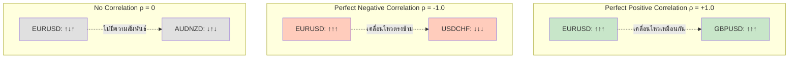

# 📐 Pearson Correlation คืออะไร?
# อธิบายสูตร ρ = Cov(X,Y) / (σX × σY) แบบละเอียด

## 🎯 คำตอบสั้นๆ

**Pearson Correlation (ρ)** คือตัวเลขที่บอกว่า **สองสิ่งเคลื่อนไหวไปด้วยกันแค่ไหน**

```
ρ (rho) = ค่าความสัมพันธ์

ค่าอยู่ระหว่าง -1 ถึง +1:
  +1 = เคลื่อนไหวไปทางเดียวกันสนิท
   0 = ไม่มีความสัมพันธ์
  -1 = เคลื่อนไหวตรงข้ามกันสนิท
```

---

## 📊 ตัวอย่างง่ายๆ ในชีวิตจริง

### ตัวอย่างที่ 1: อุณหภูมิกับยอดขายไอศกรีม
```
อุณหภูมิ (°C)  | ยอดขายไอศกรีม (แก้ว)
----------------|----------------------
    20          |        50
    25          |        75
    30          |       100
    35          |       125
    40          |       150

การวิเคราะห์:
- อุณหภูมิขึ้น → ยอดขายขึ้น
- เคลื่อนไหวไปทางเดียวกัน
- Correlation = +0.95 (Positive สูง)
```

### ตัวอย่างที่ 2: ราคาน้ำมันกับยอดขายรถยนต์
```
ราคาน้ำมัน (บาท/ลิตร) | ยอดขายรถ (คัน)
------------------------|------------------
        30              |      1000
        35              |       900
        40              |       800
        45              |       700
        50              |       600

การวิเคราะห์:
- น้ำมันขึ้น → ยอดขายลง
- เคลื่อนไหวตรงข้ามกัน
- Correlation = -0.95 (Negative สูง)
```

---

## 🔢 สูตร Pearson Correlation

```
        Cov(X,Y)
ρ = ─────────────
     σX × σY

โดยที่:
  ρ (rho)     = Pearson Correlation Coefficient
  Cov(X,Y)    = Covariance ระหว่าง X และ Y
  σX          = Standard Deviation ของ X
  σY          = Standard Deviation ของ Y
```

---

## 📐 แต่ละส่วนคืออะไร?

### 1. **Covariance (Cov)** = ความแปรปรวนร่วม

**คำถาม:** X และ Y เคลื่อนไหวไปด้วยกันไหม?

```
สูตร Covariance:

Cov(X,Y) = Σ[(Xi - X̄)(Yi - Ȳ)] / (n-1)

โดยที่:
  Xi = ค่า X ตัวที่ i
  X̄  = ค่าเฉลี่ยของ X
  Yi = ค่า Y ตัวที่ i
  Ȳ  = ค่าเฉลี่ยของ Y
  n  = จำนวนข้อมูล
```

**ความหมาย:**
- **Cov > 0** → X ขึ้น, Y ก็ขึ้น (เคลื่อนไหวไปด้วยกัน)
- **Cov < 0** → X ขึ้น, Y ลง (เคลื่อนไหวตรงข้าม)
- **Cov = 0** → ไม่มีความสัมพันธ์

### 2. **Standard Deviation (σ)** = ส่วนเบี่ยงเบนมาตรฐาน

**คำถาม:** ข้อมูลกระจายแค่ไหน?

```
สูตร Standard Deviation:

σ = √[Σ(Xi - X̄)² / (n-1)]

โดยที่:
  Xi = ค่าตัวที่ i
  X̄  = ค่าเฉลี่ย
  n  = จำนวนข้อมูล
```

**ความหมาย:**
- **σ สูง** → ข้อมูลกระจายมาก (ผันผวนสูง)
- **σ ต่ำ** → ข้อมูลกระจายน้อย (ผันผวนต่ำ)

---

## 🧮 ตัวอย่างการคำนวณแบบละเอียด

### ข้อมูล: ราคา EURUSD และ GBPUSD

```
วัน | EURUSD | GBPUSD
----|--------|--------
 1  | 1.1000 | 1.2500
 2  | 1.1010 | 1.2512
 3  | 1.1020 | 1.2520
 4  | 1.1005 | 1.2505
 5  | 1.1015 | 1.2515
```

### ขั้นตอนที่ 1: คำนวณ Returns (ผลตอบแทน)

```
Returns = (ราคาวันนี้ - ราคาเมื่อวาน) / ราคาเมื่อวาน

EURUSD Returns:
  วัน 2: (1.1010 - 1.1000) / 1.1000 = 0.0009 = +0.09%
  วัน 3: (1.1020 - 1.1010) / 1.1010 = 0.0009 = +0.09%
  วัน 4: (1.1005 - 1.1020) / 1.1020 = -0.0015 = -0.15%
  วัน 5: (1.1015 - 1.1005) / 1.1005 = 0.0009 = +0.09%

GBPUSD Returns:
  วัน 2: (1.2512 - 1.2500) / 1.2500 = 0.0010 = +0.10%
  วัน 3: (1.2520 - 1.2512) / 1.2512 = 0.0006 = +0.06%
  วัน 4: (1.2505 - 1.2520) / 1.2520 = -0.0012 = -0.12%
  วัน 5: (1.2515 - 1.2505) / 1.2505 = 0.0008 = +0.08%
```

### ขั้นตอนที่ 2: คำนวณค่าเฉลี่ย (Mean)

```
EURUSD Returns (X):
X = [0.0009, 0.0009, -0.0015, 0.0009]

X̄ = (0.0009 + 0.0009 - 0.0015 + 0.0009) / 4
X̄ = 0.0012 / 4
X̄ = 0.0003

GBPUSD Returns (Y):
Y = [0.0010, 0.0006, -0.0012, 0.0008]

Ȳ = (0.0010 + 0.0006 - 0.0012 + 0.0008) / 4
Ȳ = 0.0012 / 4
Ȳ = 0.0003
```

### ขั้นตอนที่ 3: คำนวณ Covariance

```
Cov(X,Y) = Σ[(Xi - X̄)(Yi - Ȳ)] / (n-1)

คำนวณแต่ละจุด:
i=1: (0.0009 - 0.0003) × (0.0010 - 0.0003) = 0.0006 × 0.0007 = 0.00000042
i=2: (0.0009 - 0.0003) × (0.0006 - 0.0003) = 0.0006 × 0.0003 = 0.00000018
i=3: (-0.0015 - 0.0003) × (-0.0012 - 0.0003) = -0.0018 × -0.0015 = 0.00000270
i=4: (0.0009 - 0.0003) × (0.0008 - 0.0003) = 0.0006 × 0.0005 = 0.00000030

ผลรวม = 0.00000360

Cov(X,Y) = 0.00000360 / (4-1)
Cov(X,Y) = 0.00000360 / 3
Cov(X,Y) = 0.0000012
```

### ขั้นตอนที่ 4: คำนวณ Standard Deviation

```
σX = √[Σ(Xi - X̄)² / (n-1)]

คำนวณ (Xi - X̄)²:
i=1: (0.0009 - 0.0003)² = 0.0006² = 0.00000036
i=2: (0.0009 - 0.0003)² = 0.0006² = 0.00000036
i=3: (-0.0015 - 0.0003)² = -0.0018² = 0.00000324
i=4: (0.0009 - 0.0003)² = 0.0006² = 0.00000036

ผลรวม = 0.00000432

σX = √(0.00000432 / 3)
σX = √0.00000144
σX = 0.0012

คำนวณ σY เหมือนกัน:
σY = 0.001
```

### ขั้นตอนที่ 5: คำนวณ Correlation

```
        Cov(X,Y)
ρ = ─────────────
     σX × σY

ρ = 0.0000012 / (0.0012 × 0.001)
ρ = 0.0000012 / 0.0000012
ρ = 1.0

ผลลัพธ์: ρ = +1.0
→ EURUSD และ GBPUSD เคลื่อนไหวไปทางเดียวกันสนิท!
```

---

## 📊 ทำไมต้องหาร σX × σY?

### เหตุผล: **Normalization (ทำให้เป็นมาตรฐาน)**

```
ปัญหา: Covariance มีหน่วย

Cov(EURUSD, GBPUSD) = 0.0000012
→ ตัวเลขนี้ดีหรือแย่? ไม่รู้!

วิธีแก้: หารด้วย Standard Deviations
→ ทำให้ได้ค่าระหว่าง -1 ถึง +1
→ เปรียบเทียบได้ง่าย!
```

### เปรียบเทียบ:

```
Covariance อย่างเดียว:
- Cov(A,B) = 0.001  → ดีหรือแย่? ไม่รู้
- Cov(C,D) = 0.5    → ดีหรือแย่? ไม่รู้

Correlation (หลังจาก normalize):
- ρ(A,B) = 0.8  → ดี! (ความสัมพันธ์สูง)
- ρ(C,D) = 0.3  → แย่! (ความสัมพันธ์ต่ำ)
```

---

## 🎯 ตัวอย่างใน Forex Trading

### สถานการณ์: เปรียบเทียบ 3 คู่เงิน

```
ต้องการหา Recovery pair สำหรับ EURUSD ที่ติดลบ

คำนวณ Correlation:
1. EURUSD vs USDCHF
   - Cov = -0.0000150
   - σEUR = 0.0012
   - σCHF = 0.0014
   - ρ = -0.0000150 / (0.0012 × 0.0014)
   - ρ = -0.0000150 / 0.00000168
   - ρ = -0.89 ← สูงมาก!

2. EURUSD vs GBPUSD
   - Cov = 0.0000120
   - σEUR = 0.0012
   - σGBP = 0.0015
   - ρ = 0.0000120 / (0.0012 × 0.0015)
   - ρ = 0.0000120 / 0.0000018
   - ρ = +0.67 ← ปานกลาง

3. EURUSD vs AUDNZD
   - Cov = 0.0000045
   - σEUR = 0.0012
   - σAUD = 0.0018
   - ρ = 0.0000045 / (0.0012 × 0.0018)
   - ρ = 0.0000045 / 0.00000216
   - ρ = +0.21 ← ต่ำมาก

สรุป: เลือก USDCHF (ρ = -0.89) เป็น Recovery pair!
```

---

## 📈 Visual Understanding



---

## 🔍 ตัวอย่างแบบ Step-by-Step

### ข้อมูลง่ายๆ: 5 จุดข้อมูล

```
วัน | X | Y
----|---|---
 1  | 1 | 2
 2  | 2 | 4
 3  | 3 | 6
 4  | 4 | 8
 5  | 5 | 10
```

### ขั้นที่ 1: หาค่าเฉลี่ย
```
X̄ = (1 + 2 + 3 + 4 + 5) / 5 = 15 / 5 = 3
Ȳ = (2 + 4 + 6 + 8 + 10) / 5 = 30 / 5 = 6
```

### ขั้นที่ 2: คำนวณส่วนเบี่ยงเบน
```
(Xi - X̄):  [-2, -1,  0,  1,  2]
(Yi - Ȳ):  [-4, -2,  0,  2,  4]
```

### ขั้นที่ 3: คำนวณ Covariance
```
Σ[(Xi - X̄)(Yi - Ȳ)]:
(-2)×(-4) = 8
(-1)×(-2) = 2
( 0)×( 0) = 0
( 1)×( 2) = 2
( 2)×( 4) = 8
ผลรวม = 20

Cov(X,Y) = 20 / (5-1) = 20 / 4 = 5
```

### ขั้นที่ 4: คำนวณ Standard Deviations
```
σX = √[Σ(Xi - X̄)² / (n-1)]
   = √[(4 + 1 + 0 + 1 + 4) / 4]
   = √[10 / 4]
   = √2.5
   = 1.58

σY = √[Σ(Yi - Ȳ)² / (n-1)]
   = √[(16 + 4 + 0 + 4 + 16) / 4]
   = √[40 / 4]
   = √10
   = 3.16
```

### ขั้นที่ 5: คำนวณ Correlation
```
ρ = Cov(X,Y) / (σX × σY)
ρ = 5 / (1.58 × 3.16)
ρ = 5 / 4.99
ρ = 1.0

ผลลัพธ์: Perfect Positive Correlation!
```

---

## 💡 ทำไม Correlation สำคัญ?

### ใน Trading:

```
1. หา Recovery Pairs
   ρ = -0.85 → ใช้เป็น hedge ได้ดี!
   ρ = +0.20 → ไม่เหมาะเป็น hedge

2. Risk Management
   ρ สูง → คู่เงินเคลื่อนไหวเหมือนกัน
          → ถือหลายคู่ = risk สูง!
   ρ ต่ำ → diversification ดีกว่า

3. Portfolio Construction
   เลือกคู่ที่ correlation ต่ำ
   → กระจายความเสี่ยง
```

---

## ⚠️ ข้อควรระวัง

### 1. Correlation ≠ Causation
```
❌ ρ สูง ไม่ได้หมายความว่า X ทำให้ Y เกิด
✅ แค่บอกว่า X และ Y เคลื่อนไหวพร้อมกัน

ตัวอย่าง:
- ยอดขายไอศกรีมและจำนวนจมน้าย มี correlation สูง
- แต่ไม่ได้หมายความว่าไอศกรีมทำให้คนจมน้ำ!
- จริงๆ แล้วเป็นเพราะอากาศร้อน (hidden factor)
```

### 2. Correlation เปลี่ยนไปตามเวลา
```
ปกติ: EURUSD vs GBPUSD = +0.85
วิกฤติ: EURUSD vs GBPUSD = +0.40
→ ต้อง recalculate เป็นระยะ!
```

### 3. Outliers มีผลมาก
```
ข้อมูล: [1, 2, 3, 4, 5]
Outlier: [1, 2, 3, 4, 100]
→ Correlation เปลี่ยนไปเยอะ!
```

---

## 🎓 สรุป

### Pearson Correlation คือ:

```
✅ ตัวเลขที่บอกความสัมพันธ์ระหว่างสองสิ่ง
✅ ค่าอยู่ระหว่าง -1 ถึง +1
✅ คำนวณจาก Covariance หารด้วย Standard Deviations
✅ ใช้ normalize ให้เปรียบเทียบได้

สูตร:
        Cov(X,Y)
ρ = ─────────────
     σX × σY
```

### ความหมาย:

```
+1.0  = เคลื่อนไหวไปด้วยกันสนิท (Perfect Positive)
+0.8  = เคลื่อนไหวไปด้วยกันสูง (Strong Positive)
+0.5  = เคลื่อนไหวไปด้วยกันปานกลาง (Moderate Positive)
 0.0  = ไม่มีความสัมพันธ์ (No Correlation)
-0.5  = เคลื่อนไหวตรงข้ามปานกลาง (Moderate Negative)
-0.8  = เคลื่อนไหวตรงข้ามสูง (Strong Negative)
-1.0  = เคลื่อนไหวตรงข้ามสนิท (Perfect Negative)
```

### การใช้งานใน Arbi Trading:

```
1. หา Recovery pairs ที่เหมาะสม
2. เลือกคู่ที่มี correlation สูง (>= 0.70)
3. ชอบ Negative correlation (เคลื่อนไหวตรงข้าม)
4. คำนวณ hedge ratio จาก correlation
5. Monitor correlation แบบ real-time
```

---

## 📚 อ้างอิง

**โค้ดในระบบ:**
```python
# utils/calculations.py
def calculate_correlation(prices1, prices2):
    # Convert to returns
    returns1 = np.diff(prices1) / prices1[:-1]
    returns2 = np.diff(prices2) / prices2[:-1]
    
    # Calculate correlation
    correlation = np.corrcoef(returns1, returns2)[0, 1]
    
    return correlation
```

**เอกสารเพิ่มเติม:**
- [CORRELATION_GUIDE.md](./CORRELATION_GUIDE.md) - คู่มือ Correlation แบบละเอียด
- [CORRELATION_DIAGRAMS.md](./CORRELATION_DIAGRAMS.md) - Visual Diagrams
- [utils/calculations.py](./utils/calculations.py) - โค้ดคำนวณจริง

---

**สร้างโดย:** Arbi Trading System  
**วันที่:** 8 ตุลาคม 2025
